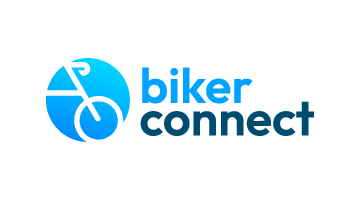
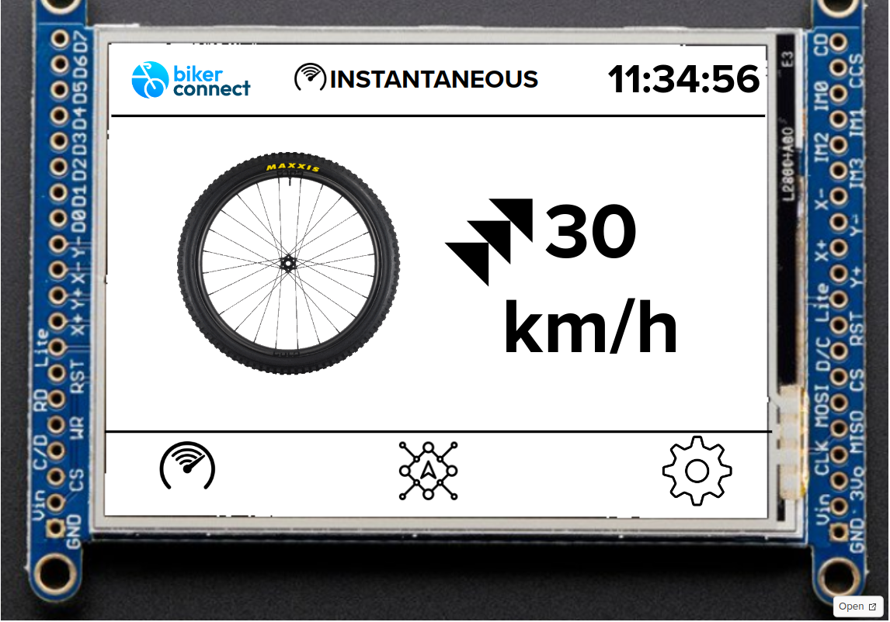
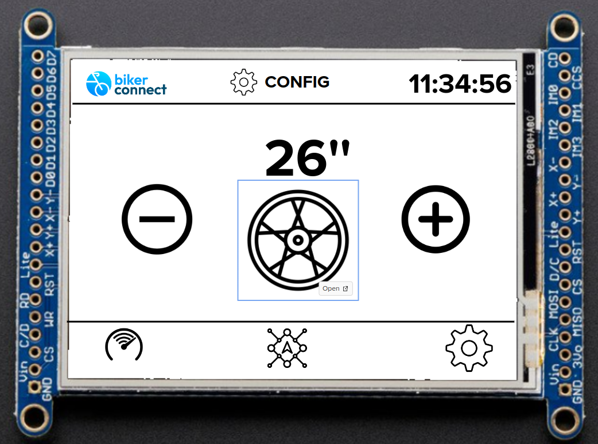
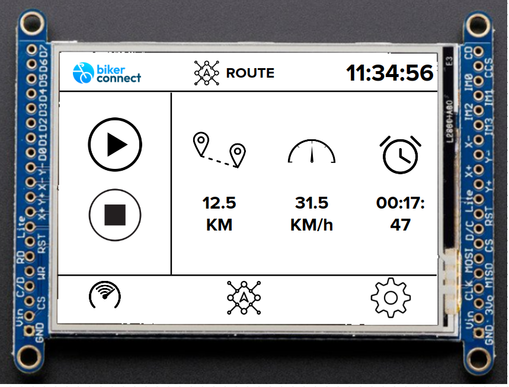
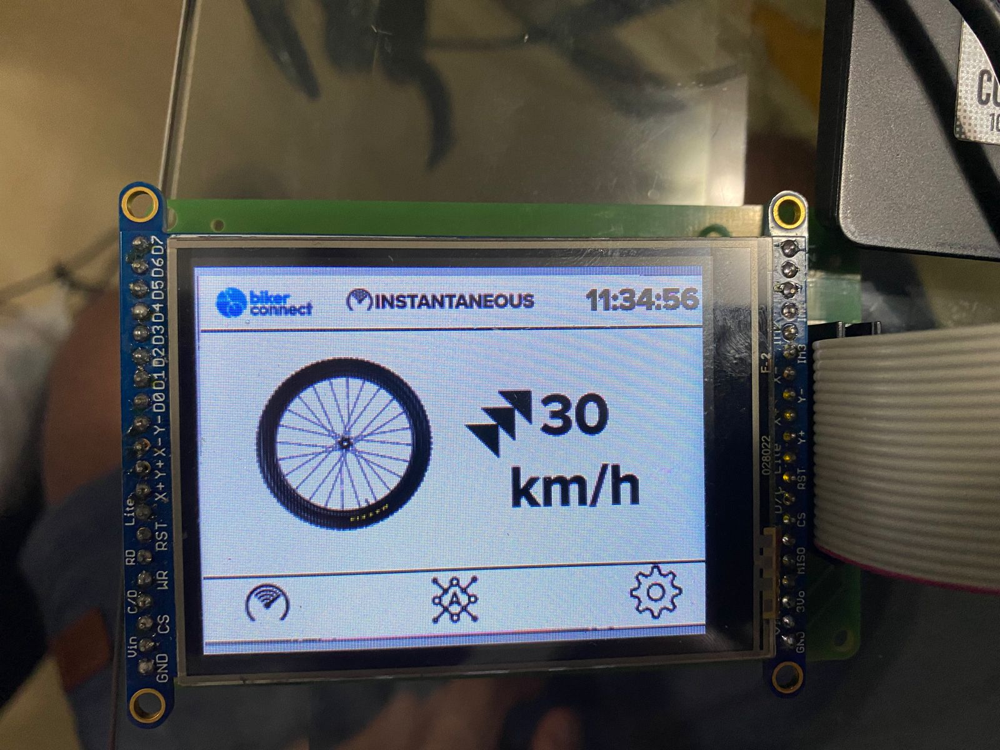
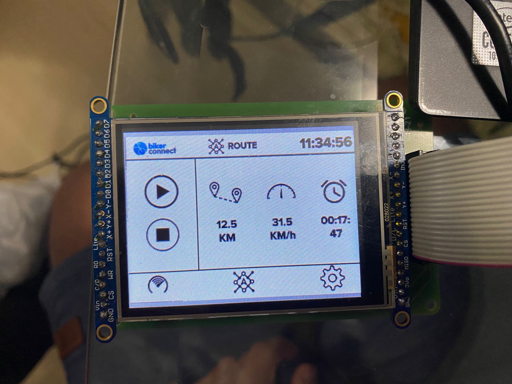
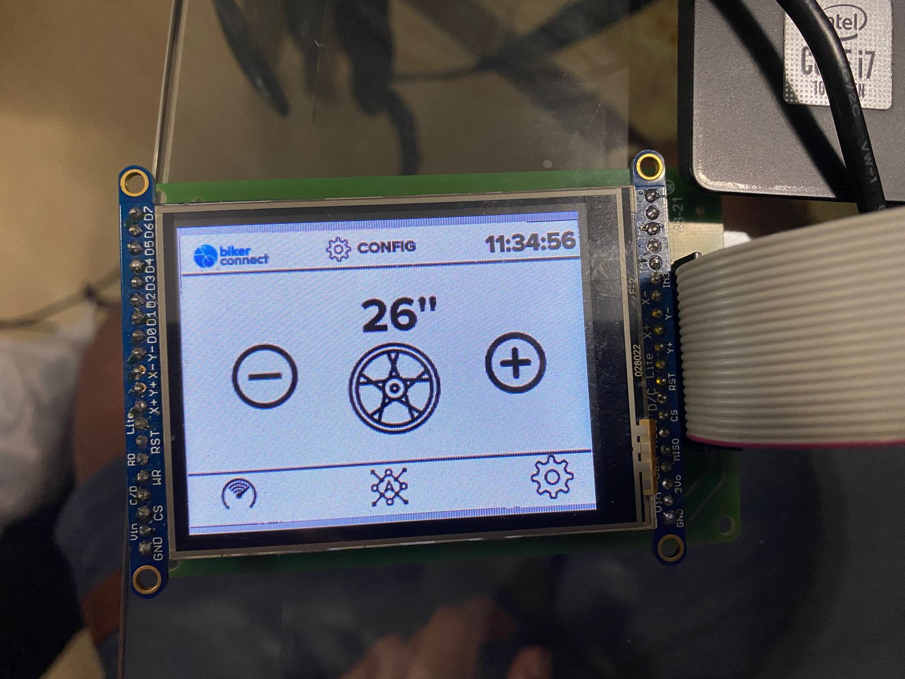

# 21b - APS2 - Embarcados

O marketing de uma empresa de equipamentos esportivos quer criar um novo ciclocomputador e você foi escolhido como desenvolvedor autônomo, dado seu background técnico e de UX, para criar um protótipo e validar a ideia.

Mais detalhes no site da disciplina:

- https://insper.github.io/ComputacaoEmbarcada/navigation/APS/APS-2-Bike/Descricao/

## Detalhes

Integrantes:

<table>
  <tr>
    <td align="center"><a href="https://github.com/matheus-1618"> <b>Matheus Oliveira</b></a>  Developer</td>
   <td align="center"><a href="https://github.com/niveaabreu"> <b>Nívea de Abreu</b></a> Developer</td>
   <td align="center"><a href="https://github.com/ykarodeandrade"> <b>Ykaro de Andrade</b></a>  Developer</td>
  </tr>
</table>

Nome da marca:

## Interface

### Proposta UX 1 - C
* [Vídeo explicando interface](https://www.youtube.com/watch?v=jwVLnyf8rFs)
* [Wigdets explicados aqui](https://app.mural.co/t/elementos9119/m/elementos9119/1667235687917/3f8bd861be517222390240d3b949be1fcf0a9fb7?sender=b72dc7a3-4993-41ce-ae83-0c04221a56ec)
* Telas disponíveis:

<table>
  <tr>
    <td align="center"> </td>
    <td align="center"> </td>
    <td align="center"> </td>
  </tr>
</table>

* Tela estática:

<table>
  <tr>
    <td align="center"> </td>
    <td align="center"> </td>
    <td align="center"> </td>
  </tr>
</table>

> - Mockup da interface:
>    - Satisfaz todos os requisitos do projeto 
>    - Indica quais são os widgets do LVGL 
>    - Apresentar uma foto da interface sendo executada no LCD (imagem estática)
> - Grava um vídeo explicando a interface

Descricão da primeira proposta da interface:

- Imagem da proposta
- Imagem da proposta no LCD
- Vídeo explicando a interface

### Proposta UX 2 - B

> - Especifica e justifica quais vão ser as fontes (e tamanhos) a serem usadas na interface.
> - Pega feedback com o Luiz do Fablab e incorpora na interface
>   - Grava em vídeo a entrevista
> - Grava um vídeo atualizado explicando o que foi sugerido e o que fizeram para melhorar a interface
> - Apresentar uma foto da interface sendo executada no LCD (imagem estática)

Detalhes da segunda interação da proposta de interface:

<!-- 
 Adicionar texto descrevendo a evolução 
 da interface
-->

- Imagem da proposta
- Imagem da proposta no LCD
- Vídeo

### Proposta UX 3 - A

> - Especifica e justifica as cores a serem usadas na interface
> - Pega feedback com mais uma pessoa externa e incorpora na interface
>     - Grava em vídeo a entrevista
> - Grava um vídeo atualizado explicando o que foi sugerido e o que fizeram para melhorar a interface
> - Apresentar uma foto da interface sendo executada no LCD (imagem estática)

Detalhes da terceira interação da proposta de interface:

<!-- 
 Adicionar texto descrevendo a evolução 
 da interface
-->

- Imagem da proposta
- Imagem da proposta no LCD
- Vídeo 
