# 21b - APS2 - Embarcados

O marketing de uma empresa de equipamentos esportivos quer criar um novo ciclocomputador e você foi escolhido como desenvolvedor autônomo, dado seu background técnico e de UX, para criar um protótipo e validar a ideia.

Mais detalhes no site da disciplina:

- https://insper.github.io/ComputacaoEmbarcada/navigation/APS/APS-2-Bike/Descricao/

## Detalhes

Integrantes:

<table>
  <tr>
    <td align="center"><a href="https://github.com/matheus-1618"> <b>Matheus Oliveira</b></a>  Developer</td>
   <td align="center"><a href="https://github.com/niveaabreu"> <b>Nívea de Abreu</b></a> Developer</td>
   <td align="center"><a href="https://github.com/ykarodeandrade"> <b>Ykaro de Andrade</b></a>  Developer</td>
  </tr>
</table>

Nome da marca:

## Interface

### Proposta UX 1 - C
## [Vídeo explicando interface](https://www.youtube.com/watch?v=jwVLnyf8rFs)

* [Wigdets explicados aqui](https://app.mural.co/t/elementos9119/m/elementos9119/1667235687917/3f8bd861be517222390240d3b949be1fcf0a9fb7?sender=b72dc7a3-4993-41ce-ae83-0c04221a56ec)
* Telas disponíveis:

<table>
  <tr>
    <td align="center"> </td>
    <td align="center"> </td>
    <td align="center"> </td>
  </tr>
</table>

* Tela estática:

<table>
  <tr>
    <td align="center"> </td>
    <td align="center"> </td>
    <td align="center"> </td>
  </tr>
</table>

### Proposta UX 2 - B

## [Vídeo apresentando display aprimorado](https://youtu.be/JXlG2QjE9qY)

Fontes utilizadas:
* Montserrat 46
* Montserrat 32
* Montserrat 28
* Montserrat 16

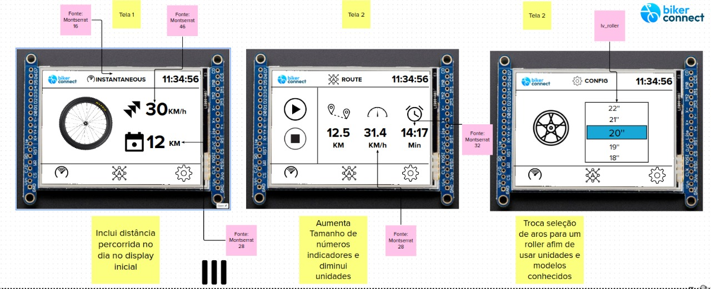

## [Entrevista com Luiz](https://drive.google.com/file/d/1zHFypN0bQBcuKHC9F2LxCIoxlhUTrHDv/view?usp=sharing)

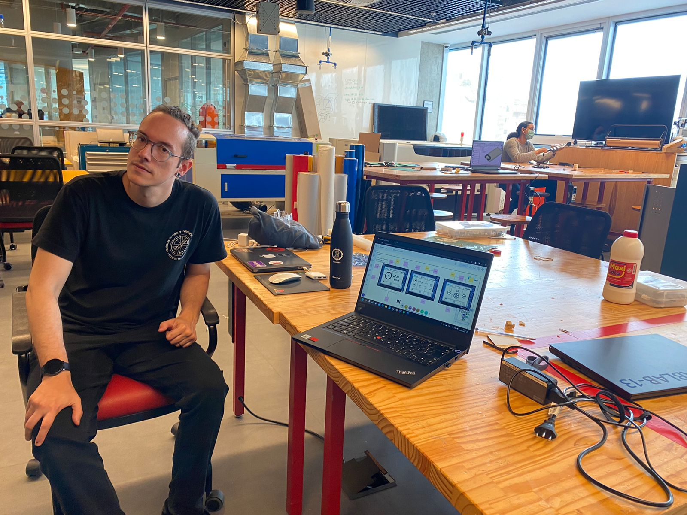

* Tela estática:

<table>
  <tr>
    <td align="center"> 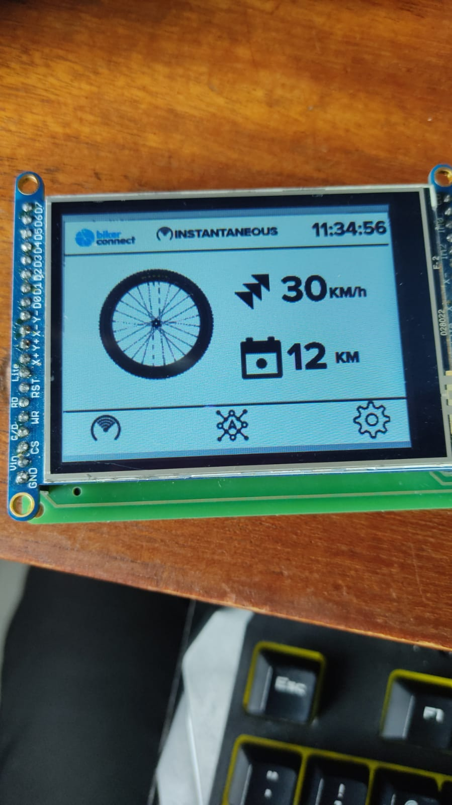</td>
    <td align="center"> 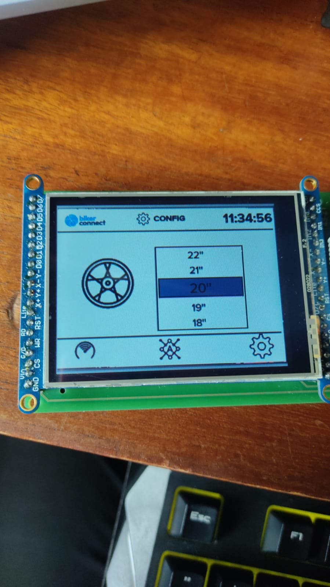</td>
    <td align="center"> 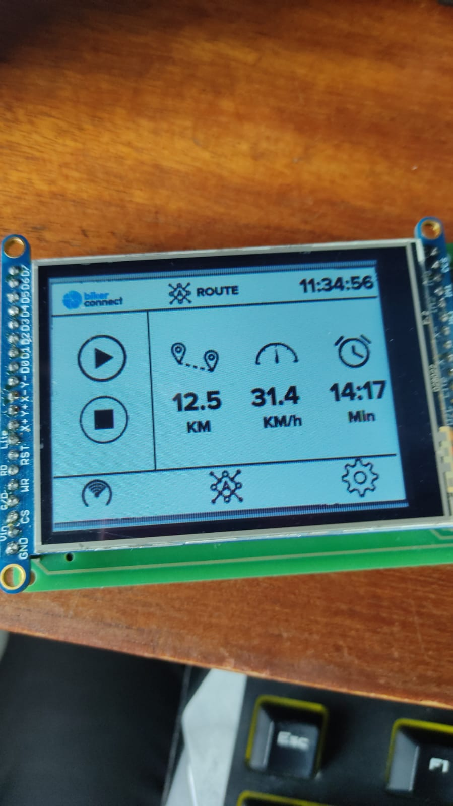</td>
  </tr>
</table>

**Detalhes da segunda interação da proposta de interface:**

Foi adiciona uma distância diária percorrida pelo ciclista. Ademais, aumentou-se a fonte dos números de velocidade, distância e cronômetro em relação a unidades para facilitar a visualização. Trocou-se também a maneira de troca do aro para um roller para usar-se medidas mais comuns no mercado.

### Proposta UX 3 - A
## [Entrevista Externa com Rodrigo - Feedback](https://youtu.be/pP0UuXKGiH0)

## [Vídeo apresentando display aprimorado para A](https://youtu.be/eCICbtYZ3Xc)

* Cores utilizadas:

 O display tem cores preto e branco padrões utilizadas. Todavia, para a paleta do Roller será utilizada a cor azul cadete (#5f9ea0),
 mantendo a aparência com a logo escolhida.

 * Telas disponíveis:

<table>
  <tr>
    <td align="center"> 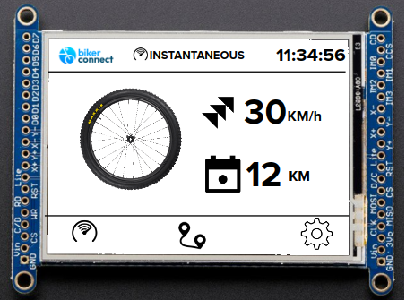</td>
    <td align="center"> 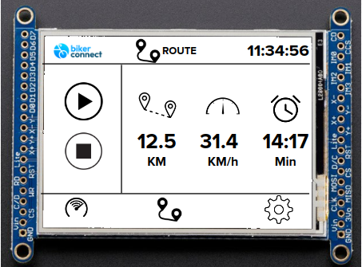</td>
    <td align="center"> 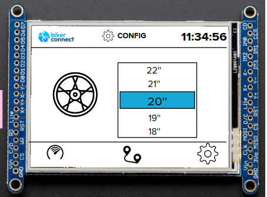</td>
  </tr>
</table>

* Tela estática:

<table>
  <tr>
    <td align="center"> 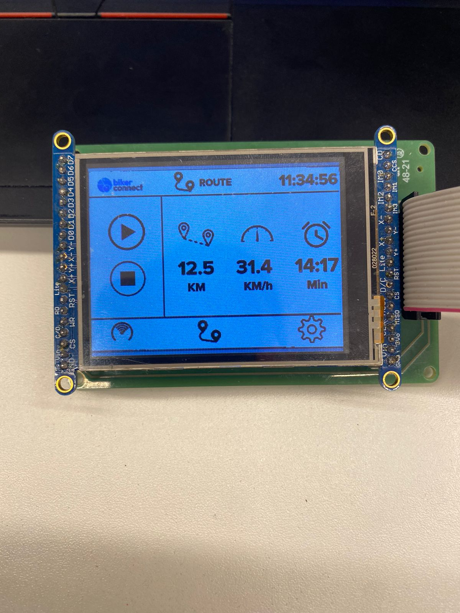</td>
    <td align="center"> 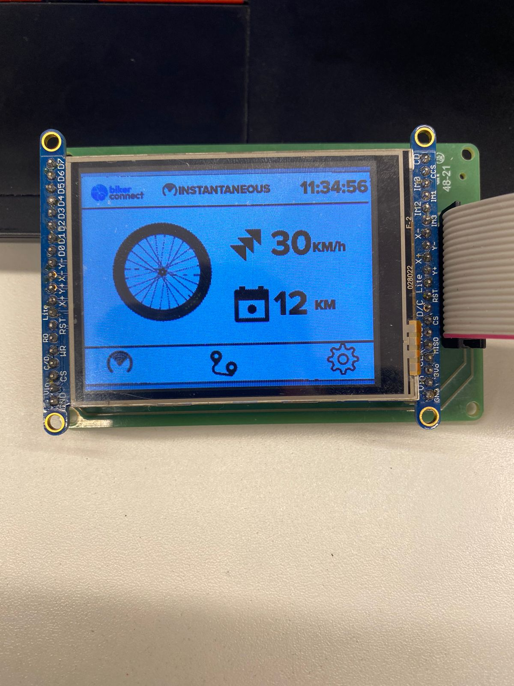</td>
    <td align="center"> 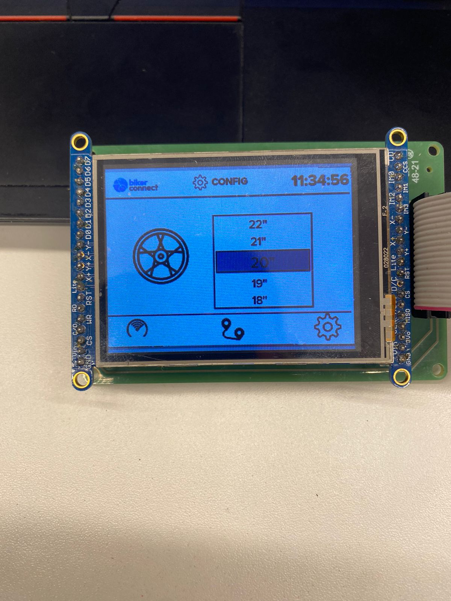</td>
  </tr>
</table>

**Detalhes da terceira interação da proposta de interface:**

Foi utilizado um ícone mais intuitivo e adaptativo para a função Route do display, melhorando a usabilidade do display.

@Insper, Computação Embarcada, Quinto Semestre